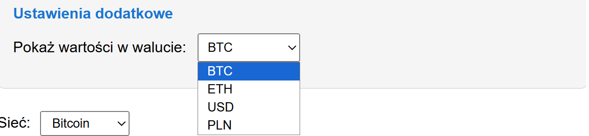
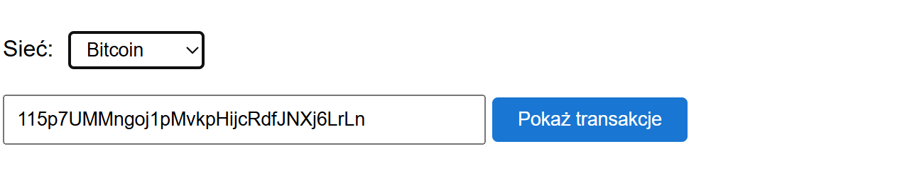
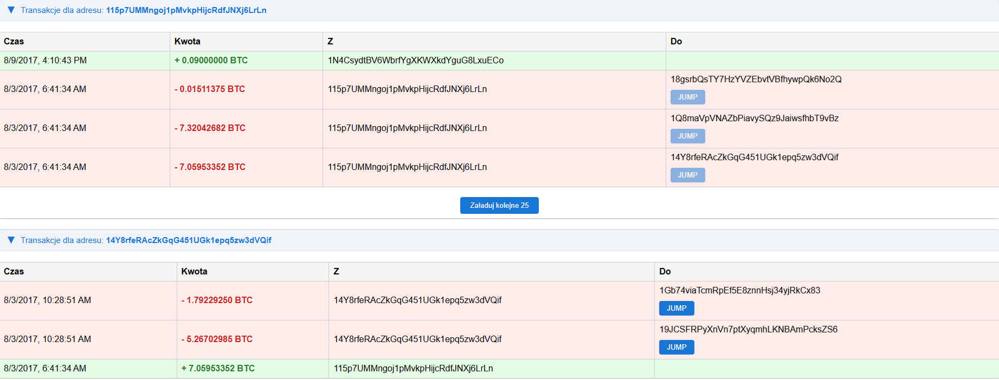
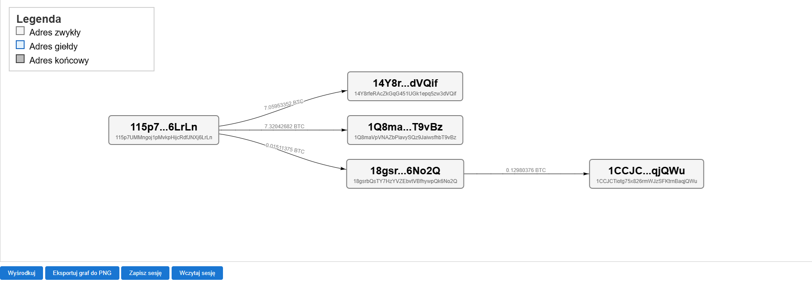
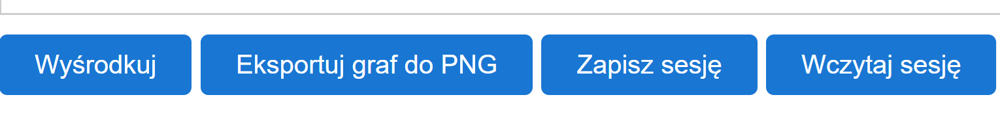
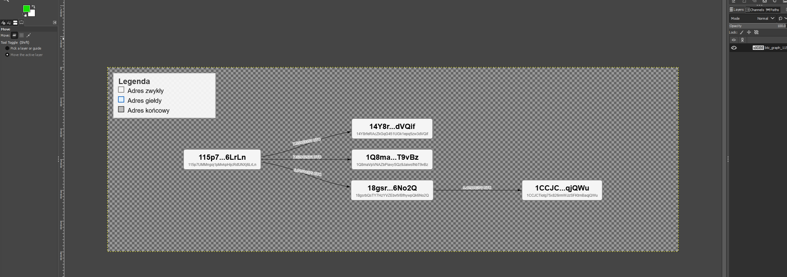
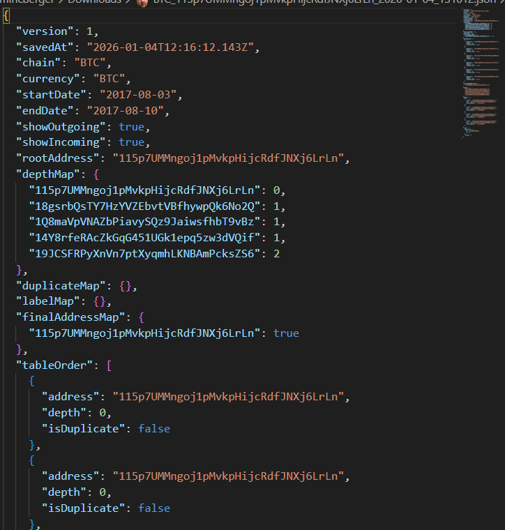
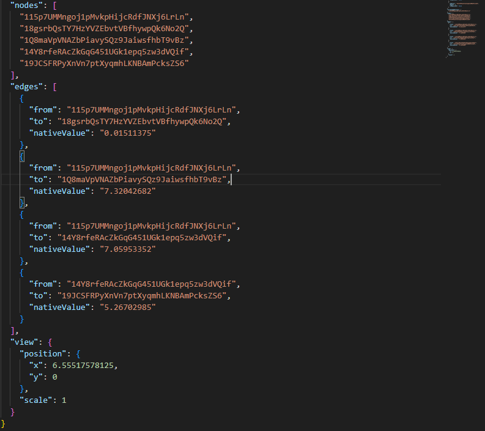

# DOKUMENTACJA PROJEKTOWA
## Wizualizator Przepływu Transakcji Blockchain (BTC/ETH)

  
  

### Skład zespołu projektowego:
**Arkadiusz Mincberger**, **Kacper Ćwiertnia**, **Szymon Woźniak**, **Mikołaj Pajor**,

  

### Przedmiot:
**Technologie Blockchain**

### Prowadzący:
**Jan Klima**

# Spis treści

1. **Wstęp i Cel Projektu**
   - 1.1. Charakterystyka sieci Blockchain
   - 1.2. Wyzwania w analizie danych on-chain
   - 1.3. Cel i zakres projektu
2. **Architektura Systemu i Technologie**
   - 2.1. Stos technologiczny
   - 2.2. Wykorzystane biblioteki i zewnętrzne API
   - 2.3. Schemat przepływu danych
3. **Szczegółowy Opis Funkcjonalności**
   - 3.1. Panel ustawień i filtrów czasowych
   - 3.2. System dynamicznego przeliczania walut
   - 3.3. Integracja z sieciami Bitcoin i Ethereum
   - 3.4  System tabelarycznej prezentacji danych
   - 3.5. Interaktywny silnik wizualizacji grafowej
   - 3.6. Eksport wyników do formatu graficznego
   - 3.7. Zarządzanie sesją i trwałość danych (JSON)
4. **Instrukcja Instalacji i Obsługi**
   - 4.1. Wymagania systemowe
   - 4.2  Konfiguracja kluczy API
   - 4.3  Uruchomienie aplikacji
   - 4.4. Proces analizy krok po kroku
5. **Rozwój Projektu i Wnioski**
   - 5.1. Możliwości rozbudowy (Roadmap)
   - 5.2. Podsumowanie

# 1. Wstęp i Cel Projektu

## 1.1. Charakterystyka sieci Blockchain
Technologia Blockchain, stanowiąca fundament nowoczesnych systemów zdecentralizowanych finansów (DeFi), opiera się na publicznej i niezmiennej księdze głównej. Sieci takie jak **Bitcoin** oraz **Ethereum** oferują pełną transparentność – każda transakcja, od momentu powstania bloku genezy, jest publicznie dostępna do wglądu. Dane te obejmują adresy nadawców, odbiorców, znaczniki czasu oraz wartości przesyłanych aktywów.

## 1.2. Wyzwania w analizie danych on-chain
Mimo powszechnej dostępności danych, ich analiza w surowej formie (raw data) stanowi wyzwanie dla przeciętnego użytkownika oraz analityków śledczych. Główne problemy to:
* **Format danych:** Informacje serwowane przez węzły sieci mają postać złożonych struktur JSON lub surowych skrótów kryptograficznych (hashy).
* **Skala:** W popularnych sieciach dochodzi do tysięcy transakcji na minutę, co uniemożliwia śledzenie powiązań "ręcznie".
* **Brak wizualizacji:** Standardowe eksploratory bloków (np. Etherscan) prezentują dane w formie tabelarycznej, co utrudnia dostrzeżenie wielopoziomowych przepływów środków między klastrami adresów.

## 1.3. Cel i zakres projektu
Niniejszy projekt ma na celu wypełnienie luki między surowymi danymi blockchainowymi a potrzebą ich intuicyjnej analizy. Głównym założeniem było stworzenie lekkiej aplikacji webowej, która:
1. Pobiera dane w czasie rzeczywistym z sieci Bitcoin oraz Ethereum.
2. Transformuje listę transakcji w **interaktywny graf powiązań**.
3. Pozwala na dynamiczne filtrowanie wyników pod kątem ram czasowych oraz kierunku przepływu kapitału.
4. Umożliwia analitykowi zapisanie stanu pracy (sesji) do późniejszej weryfikacji.

Aplikacja została zaprojektowana jako narzędzie typu *Client-Side Only*, co gwarantuje prywatność analiz (dane nie są przesyłane na serwer zewnętrzny poza zapytaniami do API).

# 2. Architektura Systemu i Technologie

## 2.1. Stos technologiczny
Projekt został zrealizowany w architekturze **Single Page Application (SPA)** przy użyciu nowoczesnych standardów webowych bez konieczności stosowania ciężkich frameworków typu React/Angular. Pozwoliło to na uzyskanie wysokiej wydajności przy wizualizacji dużych zbiorów danych.

* **Logic Layer:** JavaScript (ES6+) z wykorzystaniem modułów (`import/export`), co zapewnia czytelność i łatwą rozbudowę.
* **Visualization Layer:** Biblioteka `vis-network`, operująca na obiektach `DataSet`, umożliwiająca renderowanie grafów w czasie rzeczywistym.
* **State Management:** Zastosowano wzorzec **Singleton** (plik `state.js`), który przechowuje globalny stan aplikacji (wybrana sieć, kursy walut, dane grafu).
* **Persistence Layer:** System plików JSON obsługiwany przez natywne API przeglądarki (`Blob`, `FileReader`).

## 2.2. Wykorzystane zewnętrzne API
Aplikacja agreguje dane z czterech niezależnych źródeł, co czyni ją zaawansowanym hubem analitycznym:

| API | Cel wykorzystania |
| :--- | :--- |
| **Moralis Deep Index API** | Pobieranie pełnej historii transakcji dla sieci Ethereum (ETH). |
| **Blockstream API** | Pobieranie danych o transakcjach dla sieci Bitcoin (BTC). |
| **CoinGecko API** | Pobieranie aktualnych kursów wymiany BTC/ETH względem USD/PLN. |
| **WalletExplorer API** | Identyfikacja znanych adresów (np. giełd) w sieci Bitcoin. |

## 2.3. Schemat przepływu danych
Proces wizualizacji transakcji przebiega według następującego schematu:
1. **Input:** Użytkownik podaje adres i wybiera zakres dat.
2. **Fetch:** Aplikacja rozpoznaje sieć i wykonuje asynchroniczne zapytanie (fetch) do odpowiedniego API.
3. **Normalize:** Surowe dane (np. z Moralis) są filtrowane pod kątem dat i kierunku (Incoming/Outgoing).
4. **Graph Update:** Nowe adresy są dodawane jako węzły (`nodes`), a transakcje jako krawędzie (`edges`).
5. **UI Update:** Tabela transakcji jest renderowana dynamicznie, a graf automatycznie dopasowuje swój układ (hierarchiczny LR).

# 3. Szczegółowy Opis Funkcjonalności

W tym rozdziale opisano główne elementy aplikacji oraz sposób ich działania z perspektywy użytkownika. Każda funkcja została zaprojektowana tak, aby ułatwić analizę powiązań między portfelami kryptowalutowymi i uczynić ją bardziej przejrzystą.

## 3.1. Panel ustawień i filtrów czasowych

### Opis funkcjonalności
Panel ustawień pozwala użytkownikowi precyzyjnie określić, jakie dane mają zostać pobrane i wyświetlone. Dzięki filtrom możliwe jest wyeliminowanie szumu informacyjnego (np. bardzo starych transakcji), co sprawia, że generowany graf jest czytelny i skupiony na celu analizy.

**Główne elementy panelu:**
* **Filtry dat (Data początkowa i końcowa):** Umożliwiają ograniczenie analizy do konkretnego okresu. Jest to kluczowe w przypadku portfeli z wieloletnią historią – aplikacja sprawdza każdą transakcję i odrzuca te, które nie mieszczą się w wybranym przedziale.
* **Rodzaj transakcji (Wychodzące/Przychodzące):** Za pomocą pól wyboru (checkboxów) użytkownik decyduje, czy chce śledzić źródła wpływów na portfel, czy tylko drogę, jaką środki go opuszczają. Odznaczenie jednej z opcji pozwala na uproszczenie wykresu.
* **Wybór waluty wyświetlania:** Aplikacja oferuje możliwość podglądu wartości transakcji w różnych jednostkach (BTC, ETH, USD, PLN). Dane o kursach walut są pobierane na bieżąco z rynku, co pozwala na natychmiastowe przeliczenie kwot bez konieczności ponownego przeszukiwania blockchaina.

*Ważny szczegół: Wszystkie operacje filtrowania i przeliczania wartości odbywają się bezpośrednio w przeglądarce użytkownika. Zapewnia to szybkość działania oraz prywatność – dane o Twojej analizie nie są wysyłane na serwery zewnętrzne.*

*Rysunek 3.1: Interfejs panelu konfiguracyjnego.*

### Instrukcja obsługi
1. **Ustawienie ram czasowych:** Wybierz daty w kalendarzu. Każde kolejne wyszukiwanie adresu lub rozwinięcie grafu będzie uwzględniać tylko transakcje z tego okresu.
2. **Filtrowanie ruchu:** Zaznacz interesujące Cię kierunki przepływu środków. Możesz to zmienić w dowolnym momencie analizy.
3. **Wybór waluty:** Wybierz walutę z listy rozwijanej. Wszystkie kwoty w tabelach oraz opisy na liniach grafu zostaną automatycznie zaktualizowane do nowej wartości.

## 3.2. System dynamicznego przeliczania walut

### Opis funkcjonalności
System ten pozwala na natychmiastową zmianę jednostek, w których wyświetlane są kwoty transakcji w całej aplikacji. Użytkownik nie musi samodzielnie przeliczać wartości kryptowalut na waluty tradycyjne, co znacznie ułatwia ocenę skali przepływów finansowych.

Aplikacja obsługuje cztery rodzaje walut:
* **Kryptowaluty natywne:** BTC (Bitcoin) oraz ETH (Ethereum) – pozwalają na analizę dokładnych wartości on-chain.
* **Waluty tradycyjne (Fiat):** USD (Dolar amerykański) oraz PLN (Polski złoty) – ułatwiają określenie rynkowej wartości transferów.

*Rysunek 3.2: Menu wyboru waluty wyświetlania.*

**Jak to działa "pod spodem"?**
Mimo że zmiana widoku jest błyskawiczna, za kulisami aplikacja wykonuje kilka zaawansowanych operacji:
1. **Pobieranie danych rynkowych:** Podczas uruchomienia aplikacja łączy się z zewnętrznym systemem **CoinGecko API**, aby pobrać aktualne kursy wymiany Bitcoina i Ethereum względem dolara i złotówki.
2. **Obliczanie kursów krzyżowych:** Jeśli wybrane API nie dostarcza bezpośredniej relacji między dwiema walutami (np. kursu BTC względem ETH), aplikacja samodzielnie oblicza te wartości na podstawie danych o ich cenie w dolarach.
3. **Aktualizacja "w locie":** Po zmianie waluty w menu, aplikacja nie pobiera danych z blockchaina ponownie. Zamiast tego, automatycznie przeszukuje wszystkie widoczne tabele oraz etykiety na grafie i przelicza każdą kwotę według nowych parametrów.

### Instrukcja obsługi
1. **Wybór waluty:** Rozwiń listę w sekcji "Pokaż wartości w walucie" i wybierz interesującą Cię jednostkę.
2. **Automatyczna aktualizacja:** Zauważ, że wszystkie kwoty w tabelach (oznaczone kolorami zielonym i czerwonym) oraz opisy na liniach łączących portfele na grafie zmieniły się natychmiast.
3. **Precyzja:** Dla kryptowalut (BTC/ETH) aplikacja wyświetla do 8 miejsc po przecinku, natomiast dla walut tradycyjnych (USD/PLN) zaokrągla wynik do 2 miejsc, co zwiększa czytelność raportu.

## 3.3. Integracja z sieciami Bitcoin i Ethereum

### Opis funkcjonalności
Aplikacja jest narzędziem wielosieciowym, co pozwala na analizę przepływów środków w dwóch najpopularniejszych ekosystemach blockchain. Wybór sieci jest kluczowy, ponieważ każda z nich posiada inną strukturę adresów oraz odrębne źródła danych (API), z których aplikacja pobiera informacje o transakcjach.

*Rysunek 3.3: Interfejs wyboru sieci oraz pole wprowadzania adresu portfela.*

**Charakterystyka obsługiwanych sieci:**
* **Bitcoin (BTC):** Dane o transakcjach pobierane są z publicznego eksploratora **Blockstream**. Dodatkowo aplikacja integruje się z serwisem **WalletExplorer**, który pełni rolę inteligentnej bazy etykiet. Pozwala to na automatyczne rozpoznanie, czy dany portfel należy do znanej giełdy, miksera lub serwisu płatniczego, co znacząco ułatwia interpretację grafu.
* **Ethereum (ETH):** W przypadku tej sieci aplikacja korzysta z profesjonalnego API **Moralis**. Integracja ta zapewnia dostęp do pełnej historii transakcji oraz pozwala na stabilne pobieranie danych nawet dla bardzo aktywnych portfeli dzięki systemowi stronicowania wyników.

**Automatyczny reset stanu:**
Ważnym mechanizmem jest całkowite czyszczenie środowiska pracy przy każdej zmianie sieci. Zapobiega to błędom wynikającym z próby łączenia transakcji z różnych blockchainów na jednym grafie. Po przełączeniu z BTC na ETH (lub odwrotnie), aktualny graf oraz tabele są usuwane, a aplikacja przygotowuje się do nowej, czystej analizy.

### Instrukcja obsługi
1. **Wybór sieci:** Rozpocznij od wybrania odpowiedniej sieci z listy rozwijanej "Sieć" (Bitcoin lub Ethereum).
2. **Wprowadzenie celu:** Wklej adres portfela, który chcesz zbadać, w pole tekstowe. Pamiętaj, aby adres był zgodny z wybraną wcześniej siecią.
3. **Uruchomienie analizy:** Kliknij przycisk **"Pokaż transakcje"**. W tym momencie aplikacja:
   * Sprawdzi poprawność dat w panelu ustawień.
   * Pobierze listę transakcji spełniających Twoje kryteria.
   * Wygeneruje pierwszy, centralny punkt na grafie (tzw. węzeł główny).
   * Wyświetli szczegółową tabelę transakcji pod polem wyszukiwania.

## 3.4. System tabelarycznej prezentacji danych

### Opis funkcjonalności
Zanim dane zostaną naniesione na graf, aplikacja prezentuje je w formie szczegółowych sekcji tabelarycznych. Jest to kluczowy element analityczny, który pozwala użytkownikowi na wgląd w surowe dane pobrane z sieci blockchain (czas, kwota, adresy) i podjęcie decyzji o dalszym kierunku śledztwa.

*Rysunek 3.4: Interfejs tabelarycznej prezentacji transakcji dla wybranego adresu.*

**Kluczowe cechy systemu tabel:**
* **Logika kolorystyczna:** Aplikacja stosuje czytelny kod barwny dla każdego wiersza. Transakcje **przychodzące (Incoming)** są wyróżnione kolorem zielonym, natomiast transakcje **wychodzące (Outgoing)** kolorem czerwonym. Ułatwia to błyskawiczną ocenę, czy dany portfel służy głównie do kumulowania środków, czy do ich dalszej dystrybucji.
* **Sekcje zwijane (Collapsible):** Każdy portfel na liście posiada własną, niezależną sekcję. Kliknięcie w nagłówek z adresem pozwala na zwinięcie tabeli, co jest niezbędne przy analizie wielu adresów jednocześnie, aby utrzymać porządek w interfejsie.
* **System stronicowania (Pagination):** W przypadku adresów o dużej aktywności, aplikacja nie ładuje wszystkich danych naraz, co mogłoby spowolnić przeglądarkę. Zamiast tego oferuje przycisk „Załaduj kolejne”, który pobiera nową paczkę danych z API i dopisuje ją do istniejącej tabeli.
* **Przycisk JUMP:** Znajduje się przy każdej transakcji wychodzącej. Jest to główny mechanizm nawigacyjny, który łączy tabelę z grafem. Kliknięcie go sprawia, że adres odbiorcy staje się nowym celem analizy.

### Instrukcja obsługi
1. **Analiza kierunków:** Po wyświetleniu tabeli zwróć uwagę na kolory. Czerwone wiersze wskazują portfele, do których wysłano środki z badanego adresu.
2. **Rozwijanie szczegółów:** Jeśli tabela jest zbyt długa, kliknij w jej nagłówek, aby ją zwinąć i zrobić miejsce na kolejne wyniki.
3. **Akcja JUMP (Podróż po blockchainie):** Aby sprawdzić, co stało się dalej z wysłanymi środkami, kliknij niebieski przycisk **JUMP** obok konkretnej transakcji. Aplikacja automatycznie:
   * Doda nowy portfel do grafu jako kolejny poziom.
   * Wygeneruje nową tabelę transakcji dla tego adresu poniżej aktualnej.
   * Narysuje połączenie (strzałkę) między portfelami na grafie.

## 3.5. Interaktywny silnik wizualizacji grafowej

### Opis funkcjonalności
Interaktywny graf stanowi wizualne podsumowanie całej analizy blockchainowej. Dzięki wykorzystaniu profesjonalnej biblioteki `vis-network`, aplikacja automatycznie układa portfele w czytelną strukturę hierarchiczną (od lewej do prawej), co pozwala na natychmiastowe prześledzenie drogi kapitału od portfela początkowego do adresów końcowych.

*Rysunek 3.5: Przykład rozbudowanego grafu powiązań z aktywną legendą.*

**Elementy wizualne grafu:**
* **Węzły (Nodes):** Reprezentują poszczególne adresy blockchain. Aplikacja stosuje trzy rodzaje oznaczeń kolorystycznych, aby ułatwić orientację w typach portfeli:
    * **Adres zwykły (jasnoszary):** Standardowy portfel użytkownika.
    * **Adres giełdy/serwisu (niebieski):** Portfel zidentyfikowany przez system jako należący do znanej instytucji (np. giełdy Binance czy Kraken).
    * **Adres końcowy (ciemnoszary):** Portfel, który w wybranym przedziale czasowym nie posiadał żadnych transakcji wychodzących (środki zatrzymały się na tym etapie).
* **Krawędzie (Edges):** Linie łączące portfele, reprezentujące konkretne transfery środków. Każda krawędź posiada strzałkę wskazującą kierunek ruchu oraz etykietę z wartością transakcji przeliczoną na wybraną przez użytkownika walutę.
* **Legenda:** Stały element wyświetlany bezpośrednio na panelu grafu, który pozwala na szybką weryfikację znaczenia kolorów węzłów bez zaglądania do dokumentacji.

**Interakcja z grafem:**
Aplikacja pozwala na pełną swobodę w nawigacji po wygenerowanym schemacie. Użytkownik może przybliżać (zoom) i oddalać widok, aby skupić się na detalach lub zobaczyć szerszy kontekst. Każdy węzeł można również ręcznie „chwycić” myszką i przesunąć, co jest przydatne przy tworzeniu zrzutów ekranu do raportów.

### Instrukcja obsługi
1. **Nawigacja:** Użyj kółka myszy, aby przybliżyć lub oddalić widok grafu. Możesz również przesuwać całe tło, klikając i przeciągając je lewym przyciskiem myszy.
2. **Organizacja widoku:** Jeśli portfele nakładają się na siebie, kliknij lewym przyciskiem na wybrany portfel i przesuń go w inne miejsce — graf automatycznie dostosuje połączenia.
3. **Centrowanie (Wyśrodkuj):** Jeśli podczas analizy graf „uciekł” poza krawędź ekranu, kliknij przycisk **"Wyśrodkuj"** pod oknem wizualizacji. Aplikacja automatycznie dopasuje skalę i pozycję tak, aby wszystkie portfele były widoczne.
4. **Interpretacja kierunku:** Śledź strzałki na liniach. Wskazują one dokładnie, do których portfeli trafiły środki po kliknięciu przycisku **JUMP** w tabeli.

## 3.6. Eksport wyników do formatu graficznego

### Opis funkcjonalności
Funkcja eksportu pozwala na natychmiastowe utrwalenie wyników analizy w postaci pliku obrazu. Jest to rozwiązanie dedykowane użytkownikom, którzy muszą udokumentować przebieg śledztwa blockchainowego lub dołączyć wypracowany graf do zewnętrznego raportu bez konieczności przesyłania całego kodu źródłowego aplikacji.

*Rysunek 3.6.1: Lokalizacja funkcji eksportu*

*Rysunek 3.6.2: Przykład wygenerowanego pliku PNG.*

**Cechy mechanizmu eksportu:**
* **Automatyczne dopasowanie widoku:** Przed wykonaniem zrzutu, aplikacja automatycznie wykonuje funkcję wyśrodkowania (`fit`), co gwarantuje, że wszystkie portfele i połączenia znajdą się w kadrze, nawet jeśli wcześniej znajdowały się poza widocznym obszarem ekranu.
* **Wysoka jakość obrazu:** Graf jest zapisywany w formacie **PNG**, co zapewnia bezstratną jakość i czytelność etykiet z kwotami oraz adresami portfeli.
* **Inteligentne nazewnictwo plików:** Aplikacja automatycznie nadaje plikom unikalne nazwy według schematu: `sieć_graph_adres_data_godzina.png`. Ułatwia to archiwizację wielu analiz i zapobiega nadpisywaniu plików.

### Instrukcja obsługi
1. **Przygotowanie grafu:** Upewnij się, że na grafie znajdują się wszystkie interesujące Cię połączenia. Możesz ręcznie przesunąć węzły, aby poprawić estetykę schematu przed zapisem.
2. **Generowanie obrazu:** Kliknij przycisk **"Eksportuj graf do PNG"** znajdujący się pod oknem wizualizacji.
3. **Pobieranie:** Przeglądarka automatycznie zainicjuje pobieranie gotowego pliku graficznego. Obraz będzie zawierał dokładnie taki stan grafu, jaki był widoczny w momencie kliknięcia, wraz z całą aktywną legendą.

## 3.7. Zarządzanie sesją i trwałość danych (JSON)

### Opis funkcjonalności
System zarządzania sesją pozwala na przerwanie analizy w dowolnym momencie i powrót do niej w przyszłości bez konieczności ponownego wyszukiwania adresów i ręcznego odtwarzania struktury grafu. Jest to kluczowa funkcja dla zaawansowanych dochodzeń blockchainowych, które mogą trwać wiele dni.

*Rysunek 3.7: Przyciski zapisu i odczytu sesji*

*Rysunek 3.7: Ogólne informacje zapisywane w pliku*

*Rysunek 3.7: Struktura grafu w exportowanym pliku*

**Co dokładnie jest zapisywane w pliku sesji?**
Aplikacja generuje plik w formacie **JSON**, który zawiera kompletny „odbiór stanu” narzędzia:
* **Konfiguracja filtrów:** Wybrana sieć (BTC/ETH), zakres dat, stany checkboxów oraz wybrana waluta wyświetlania.
* **Struktura grafu:** Wszystkie wygenerowane węzły i krawędzie wraz z ich powiązaniami.
* **Stan interfejsu (UI):** Informacja o tym, które tabele transakcji były otwarte, a które zwinięte, oraz w jakiej kolejności były dodawane.
* **Pozycja kamery:** Dokładny stopień przybliżenia (zoom) i punkt, na który użytkownik patrzył na grafie.

**Bezpieczeństwo i prywatność:**
Pliki sesji są przechowywane wyłącznie lokalnie na komputerze użytkownika. Aplikacja nie wysyła tych danych do żadnej chmury, co gwarantuje pełną poufność prowadzonych analiz.

### Instrukcja obsługi
1. **Zapisywanie pracy:** Kliknij przycisk **"Zapisz sesję"**. Aplikacja wygeneruje plik o nazwie zawierającej sieć, adres główny oraz aktualną datę (np. `BTC_1A1zP..._2025-01-04.json`) i automatycznie go pobierze.
2. **Wczytywanie sesji:** Aby wrócić do analizy, kliknij **"Wczytaj sesję"** i wybierz wcześniej zapisany plik JSON z dysku. 
3. **Automatyczne przywracanie:** Po wczytaniu pliku aplikacja:
   * Przywróci wszystkie ustawienia i widok grafu.
   * Automatycznie ponownie pobierze transakcje z API dla wszystkich widocznych tabel, aby upewnić się, że dane są aktualne.
   * Ustawi kamerę grafu w tym samym miejscu, w którym zakończono pracę.

# 4. Instrukcja Instalacji i Obsługi

W niniejszym rozdziale opisano wymagania techniczne oraz procedurę niezbędną do poprawnego uruchomienia aplikacji w środowisku lokalnym.

## 4.1. Wymagania systemowe
Aplikacja została zaprojektowana jako lekka aplikacja typu SPA (Single Page Application), dzięki czemu do jej działania wymagane są jedynie podstawowe narzędzia:
* **Przeglądarka internetowa:** Zalecane wersje Google Chrome, Mozilla Firefox lub Microsoft Edge (z obsługą standardów ES6+).
* **Dostęp do internetu:** Niezbędny do pobierania zewnętrznych bibliotek (CDN) oraz komunikacji z API sieci blockchain (Moralis, Blockstream) i kursów walut (CoinGecko).
* **Lokalny serwer (opcjonalnie):** Ze względu na wykorzystanie modułów JavaScript (`type="module"`), zaleca się uruchamianie aplikacji przez lokalny serwer (np. rozszerzenie "Live Server" w VS Code), aby uniknąć błędów związanych z polityką CORS.

## 4.2. Konfiguracja kluczy API
Aplikacja do poprawnego działania w sieci Ethereum wymaga aktywnego klucza API Moralis.

1.  Otwórz plik `js/config.js` w dowolnym edytorze tekstu.
2.  Zlokalizuj stałą `MORALIS_API_KEY`.
3.  Upewnij się, że znajduje się tam poprawny klucz. W wersji projektowej klucz jest wpisany bezpośrednio w kodzie, co pozwala na natychmiastowe testowanie aplikacji.

## 4.3. Uruchomienie aplikacji
1.  Pobierz folder z projektem na dysk lokalny.
2.  Upewnij się, że struktura plików jest zachowana (pliki `.js` znajdują się w odpowiednich podfolderach).
3.  Otwórz plik `index.html` w przeglądarce internetowej.
4.  Przy starcie aplikacja automatycznie zainicjuje silnik grafu oraz pobierze aktualne kursy walut z serwisu CoinGecko.

## 4.4. Proces analizy krok po kroku
Aby przeprowadzić kompletną analizę przepływu środków, wykonaj następujące kroki:
1.  **Konfiguracja:** Wybierz sieć (BTC/ETH) oraz zakres dat w panelu ustawień.
2.  **Start:** Wklej adres portfela i kliknij "Pokaż transakcje". Aplikacja pobierze dane i wygeneruje pierwszą tabelę oraz główny węzeł na grafie.
3.  **Eksploracja:** Przejrzyj tabelę. Znajdź transakcje wychodzące (oznaczone na czerwono) i użyj przycisku **JUMP**, aby sprawdzić odbiorców środków.
4.  **Wizualizacja:** Obserwuj, jak graf automatycznie rozbudowuje się o kolejne poziomy. Możesz swobodnie przesuwać węzły, aby poprawić czytelność schematu.
5.  **Archiwizacja:** Po zakończeniu analizy wyeksportuj graf do pliku PNG lub zapisz całą sesję do pliku JSON, aby móc wrócić do pracy później.

# 5. Rozwój Projektu i Wnioski

Ostatni rozdział dokumentacji podsumowuje zrealizowane prace oraz wskazuje kierunki, w których aplikacja może być rozwijana, aby stać się jeszcze potężniejszym narzędziem analitycznym.

## 5.1. Możliwości rozbudowy (Roadmap)

Mimo że obecna wersja aplikacji jest w pełni funkcjonalna i pozwala na kompleksowe śledzenie środków, zidentyfikowano trzy główne obszary dalszego rozwoju:

1. **Automatyczna identyfikacja i reprezentacja klastrów:**
   Obecnie aplikacja rozpoznaje pojedyncze adresy giełd dzięki zewnętrznym bazom danych. Przyszły rozwój zakłada wdrożenie funkcjonalności, które pozwoliłyby automatycznie grupować wiele portfeli należących do tego samego podmiotu w jeden wizualny "klaster". Zwiększyłoby to czytelność grafu przy analizie bardzo złożonych struktur finansowych.

2. **Wizualizacja wolumenu środków (Graf typu Sankey):**
   Wprowadzenie mechanizmu dynamicznego dostosowywania grubości linii (krawędzi) w zależności od wartości przesyłanych środków. W takim modelu im większa kwota transakcji, tym grubsza linia łącząca portfele. Pozwoliłoby to analitykowi na błyskawiczne zidentyfikowanie głównych kanałów przepływu kapitału bez konieczności odczytywania poszczególnych etykiet.

3. **Zwiększenie interaktywności grafu:**
   Przeniesienie ciężaru nawigacji bezpośrednio na okno wizualizacji. Zamiast szukać przycisku JUMP w tabeli, użytkownik mógłby kliknąć prawym przyciskiem myszy bezpośrednio na węzeł (portfel) na grafie i z menu kontekstowego wybrać opcję rozszerzenia analizy o ten adres. Dodatkowo, pełna swoboda w blokowaniu pozycji węzłów pozwoliłaby na tworzenie jeszcze bardziej precyzyjnych map powiązań.

## 5.2. Podsumowanie

Projekt "Wizualizator Przepływu Transakcji Blockchain" udowodnił, że możliwe jest stworzenie lekkiego, a jednocześnie zaawansowanego narzędzia analitycznego działającego w całości w przeglądarce użytkownika.

Kluczowe osiągnięcia projektu to:
* **Skuteczna synteza danych:** Połączenie surowych informacji z blockchainów Bitcoin i Ethereum z danymi rynkowymi CoinGecko oraz bazami etykiet WalletExplorer.
* **Przejrzystość wizualna:** Zastosowanie hierarchicznego układu grafu, który w sposób naturalny oddaje proces "rozpływania się" środków w sieci.
* **Ciągłość pracy:** Wdrożenie zaawansowanego systemu sesji, który pozwala na trwałe zapisywanie postępów analizy do plików JSON.

Aplikacja stanowi solidną bazę dla narzędzi typu *Open Source Intelligence* (OSINT) w obszarze kryptowalut, oferując użytkownikom prywatność, szybkość działania i intuicyjny interfejs, który zmienia skomplikowane ciągi znaków w czytelne mapy powiązań.

